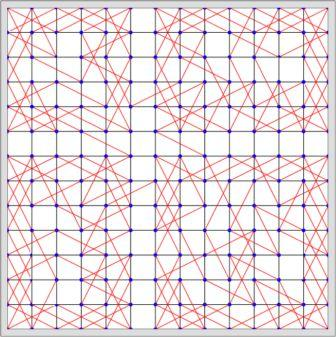

# Knight's Tour Visualization

_Knight's tour visualization in C++ and JavaScript using divide and conquer algorithm._

The route would be shown in animation.

Visit https://chromezh.github.io/knights-tour-visualization/ for details.

## Build

**Prerequisites**

* Emscripten
* UglifyJS

**Build Script**

`make` or `mingw32-make`.

Then open `index.htm` in `docs` folder.

## Implementation

The code is an implementation of Ian Parberry's _An efficient algorithm for the Knight's tour problem_.
