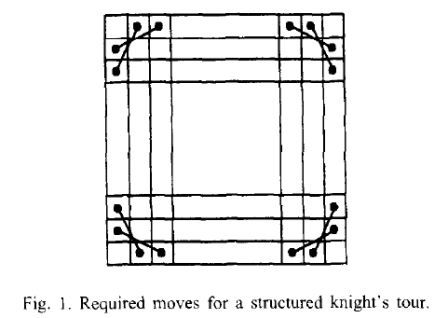
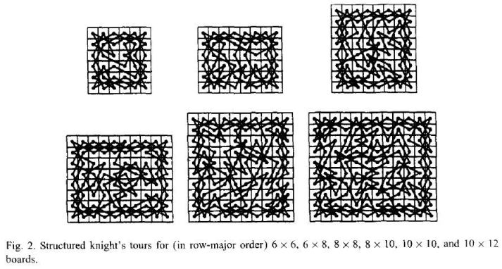
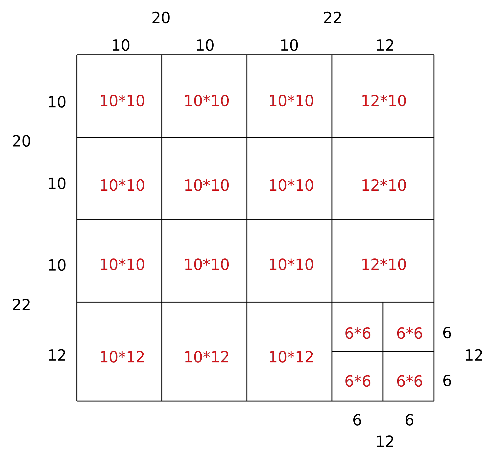
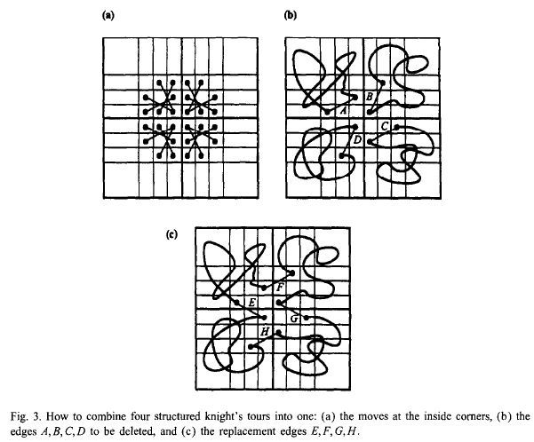
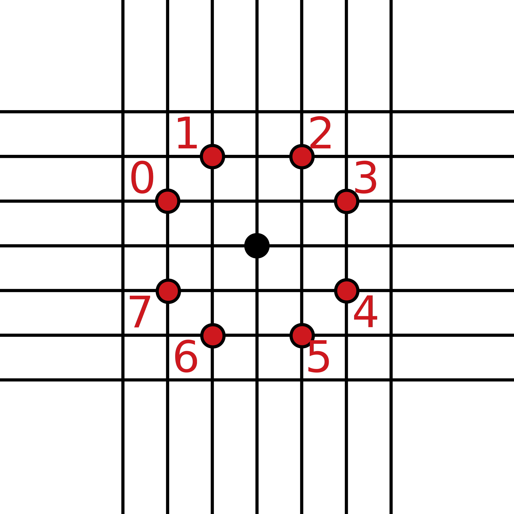

# Knight's Tour Visualization

  

Knight's tour visualizer in C and JavaScript using divide and conquer algorithm, with the route shown in animation.

[Emscripten](http://kripken.github.io/emscripten-site/) is used to compile the C code into JavaScript.

For an online version, see https://chromezh.github.io/knights-tour-visualization/.

## Build

**Prerequisites**:

* [GNU Make](http://www.gnu.org/software/make/)
* [Emscripten](http://kripken.github.io/emscripten-site/)

**Build Script**: Run `make`. Then open `index.htm` in `docs` folder.

## Implementation

### Algorithm

The code is an implementation of _Parberry, Ian. "An efficient algorithm for the Knight's tour problem." Discrete Applied Mathematics 73.3(1997):251-260_.

A knight’s tour is called _**closed**_ if the last square visited is also reachable from the first square by a knight’s move.

A knight’s tour is said to be _**structured**_ if it includes the knight’s moves shown in Fig. 1.

An _n_ \* _n_ chessboard has a closed knight's tour iff _n_ ≥ 6 is even.

For board size of 6 \* 6, 6 \* 8, 8 \* 8, 8 \* 10, 10 \* 10, and 10 \* 12, we have already found **structured**, **closed** knight’s tours, which are shown in Fig. 2.

This means the problem is already solved when _n_ ∈ {6, 8, 10}.

For larger _n_, divide the chess board into parts to meet the sizes above. For instance, a board with _n_ = 42 can be divided as follows:

Then connect the parts together. Since all the parts are structured, we can combine them by substitute the directions on the corners:

### Data Structure

Since every point is connected with other two points, and there are only 8 possible directions (from 0 to 7):

The 6 pre-defined tours are stored in 2-dimensional arrays.

There are 8 types of corners (as were shown in Fig. 3.), which are denoted by 0-7, is recorded in _**point attribute**_. Besides, the point attribute of ordinary points is 8.
